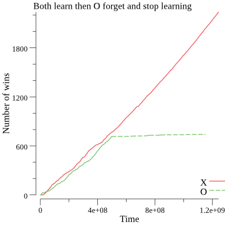
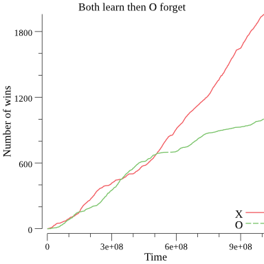

# A reinforcement leaning algorithm that learn to play tic-tac-toe
This is as an exercise to practice with RL. I wanted to build the agent and the environment without any libraries.

I choose golang because I am learning the language.

I choose tic-tac-toe because in my foolish youth I coded an "AI" full of if that play tic-tac-toe. I wanted see how it would work with RL.

## Structure
Two agents play against each other. For the first part of the program, both of them are learning to play as they play. We can see that their results are the same. But at the half, the second agent 'forget' what it has learned and also stop learning. It then become clear that one of them knows how to play and the other does not.

## Output example
| Both learning | o forget | o forget and stop learning |
| :-----------: | :------: | :------------------------: |
| **x** wins **52.1%** times | **x** wins **78.9%** times | **x** wins **99.2%** times |
| **o** wins **47.3%** times | **x** wins **20.4%** times | **o** wins **0.66%** times |

|||
| - | - |
|  |  |

## Observation
It does not take long for an agent to learn. I first, after the second agent forgot what it has learned, I was letting it learning again. The consequence was that the distinction between the two agents wins wasn't clear. That is why I also make the second agent to stop learning.

## TODO
- [x] Make the output better. A graph showing the learning curves of the agents ?
